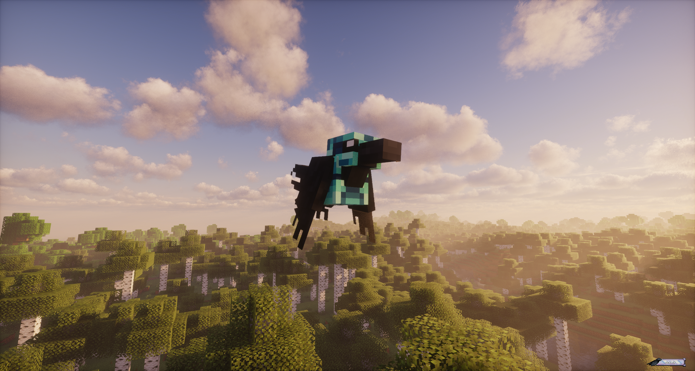
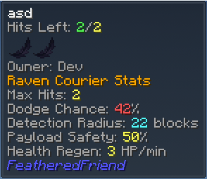

# Raven Armors

Raven armor is **gear for your Raven**, not for you. Think of it like a “courier loadout”:

- It changes how tough your Raven is when it gets bonked mid-flight.
- It changes how far your Raven can **sense trouble** (hostile mobs / players).
- It can help your Raven **keep the scroll safe** when taking a hit.

TLDR: **Netherite is the tanky “deliver it no matter what” pick. Gold is the “don’t get hit in the first place” pick.**

Here’s a Raven in Diamond armor, just so you know what you’re aiming for:

---

## How to equip / remove

### Equip
1. Craft a Raven Armor item.
2. Hold it in your hand.
3. **Right-click your tamed Raven**.

Your Raven swaps to that armor instantly, and the previous armor (if any) pops back into your inventory (or drops on the ground if you’re full).

### Remove
1. Empty hand.
2. **Sneak + right-click your tamed Raven**.

---

## What the stats mean

These show up in the item tooltip as **Courier Stats**.

- **Max Hits**: how many *landed* hits your Raven can take before dying.
- **Dodge Chance**: chance to dodge a hit completely. (Base Raven is **25%**.)
- **Detection Radius**: how far (in blocks, **3D**) your Raven notices threats for the Raven Log / Status badge.
- **Payload Safety**: chance the Raven **keeps the scroll** when it takes a hit during delivery.
- **Health Regen**: how fast the Raven recovers over time (HP per minute).

??? tip "Using Jade? Crouch."
    Jade can show the full breakdown when you crouch while looking at your Raven:

    

??? info "Under the hood (exact rules)"
    - Damage amount doesn’t matter: **one landed hit = one hit**.
    - **Dodged hits do zero damage** (they don’t count as a “hit”).
    - Payload Safety is a roll **per landed hit** while carrying a scroll.
        - Fail the roll: the scroll drops on the ground and the job is over.
        - Win the roll: the Raven bails out and the job gets retried.
    - Detection Radius is used as a true **sphere check** (not just horizontal range).

---

## Armor comparison

Base Raven (no armor): **1** Max Hit, **25%** dodge, **10** block detection, **0%** payload safety, **0** regen.

| Armor | Max Hits | Dodge Chance | Detection Radius | Payload Safety | Regen |
|---|---:|---:|---:|---:|---:|
| Leather | 2 | 35% | 10 | 15% | 2 / min |
| Copper | 3 | 22% | 18 | 35% | 1 / min |
| Iron | 4 | 18% | 16 | 25% | 1 / min |
| Gold | 2 | 42% | 22 | 50% | 3 / min |
| Diamond | 5 | 28% | 14 | 40% | 2 / min |
| Netherite | 6 | 15% | 28 | 70% | 2 / min |

!!! tip
    If you’re mostly doing deliveries in sketchy places (Nether, caves, PvP servers), **Payload Safety** is the stat you’ll *feel* the most.

---

## Recipes

All Raven Armors use the same shape — you’re basically making a tiny “plate” for your bird.

=== "Leather"
    

      

        

        

        

        

        

        

        

      

      
→

      

        

      

    

=== "Copper"
    

      

        

        

        

        

        

        

        

      

      
→

      

        

      

    

=== "Iron"
    

      

        

        

        

        

        

        

        

      

      
→

      

        

      

    

=== "Gold"
    

      

        

        

        

        

        

        

        

      

      
→

      

        

      

    

=== "Diamond"
    

      

        

        

        

        

        

        

        

      

      
→

      

        

      

    

=== "Netherite"
    

      

        

        

        

        

        

        

        

      

      
→

      

        

      

    

---

## FAQ

**Does armor stick to my Raven forever?**  
It sticks to *your Raven* until you swap/remove it. If your Raven dies, the armor drops as an item where it died.

**Does this help with PvP / griefing?**  
It helps the Raven survive and notice trouble sooner, but it’s not a magic shield. A determined player can still ruin your day. (And yes, your Raven does notice other players.)
