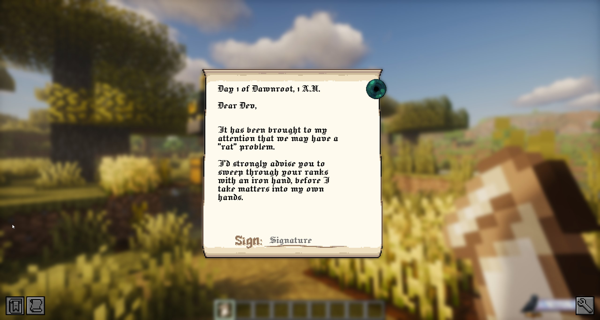
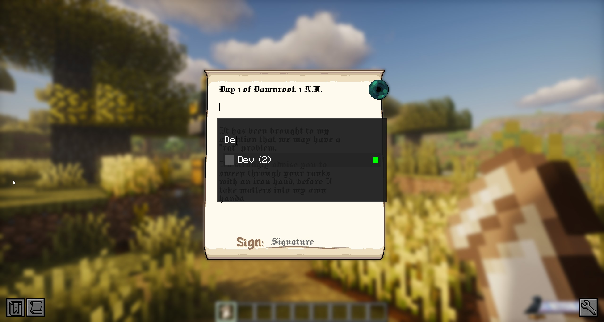
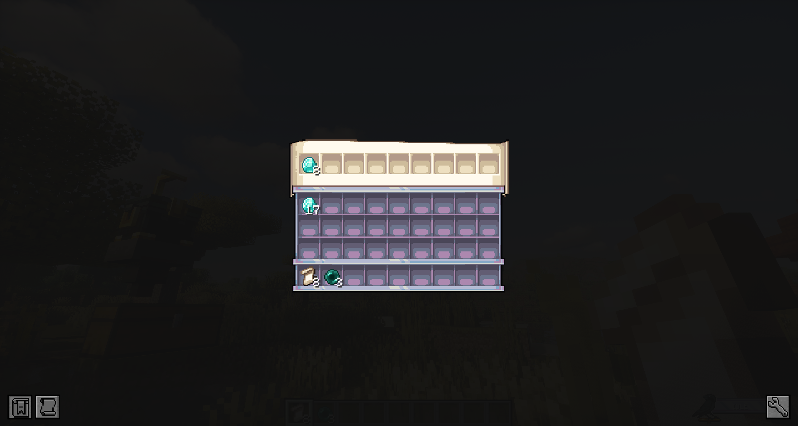
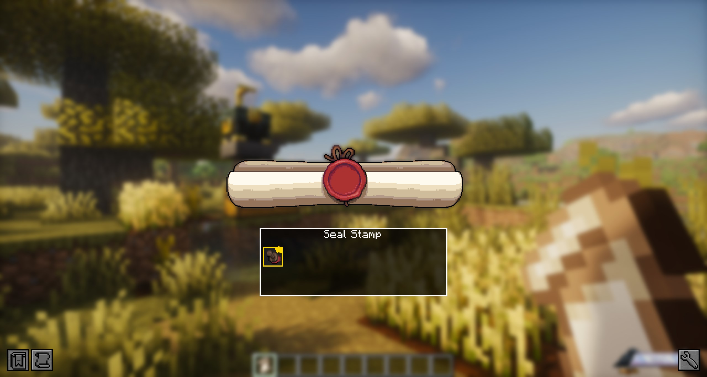
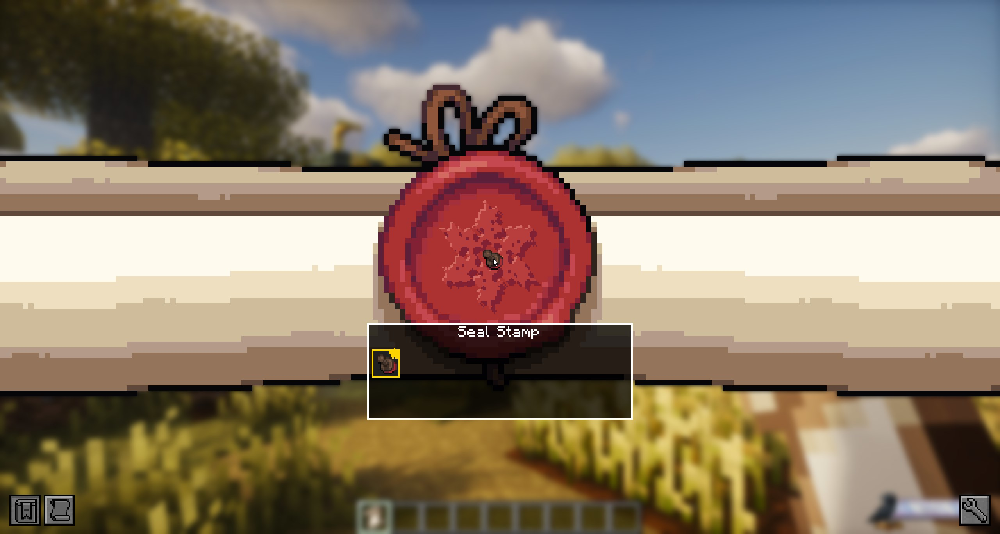
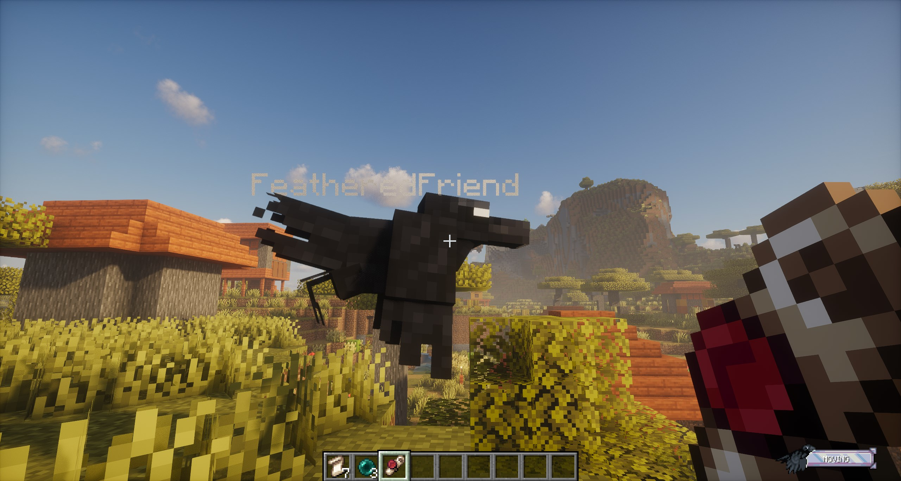

# Scrolls

Scrolls are FeatheredFriend's "mail system". You write one, seal it with wax + a sigil, then hand it to your tamed Raven and let the bird do the awkward social interaction for you.

TLDR:

1. Craft an **Unsealed Scroll** (paper -> scroll).
2. Write your message + pick a recipient.
3. (Optional) Attach items.
4. **Sign** it.
5. Pick a **Seal Stamp** and click the wax to seal it.
6. Give the **Sealed Scroll** to your tamed Raven.

<figure markdown>

<figcaption>Scroll editor (Unsealed Scroll). This is where the whole thing starts.</figcaption>
</figure>

---

## Crafting: Unsealed Scroll

Two paper, stacked vertically. (The recipe is 1-wide, so any column works.)

  

    

    

    

  

  
&rarr;

  

    

  

---

## Writing the scroll

Right-click an **Unsealed Scroll** to open the editor.

### Recipient picker (the list)

Click into the **Recipient** line while it's empty, and you'll get a little player list overlay.

<figure markdown>

<figcaption>The recipient list. Green dot = online, red dot = offline. The number in parentheses is mailbox count.</figcaption>
</figure>

What you're seeing in that list:

- **Online/offline dot**: green is online, red is offline.
- **Mailbox count**: the number in parentheses is how many mailboxes your Raven has recorded for that player.
  - `Name (0)` basically means "no mailbox spots known" (yet).

You can type in the overlay's filter box to search names.

### The important part: recipient *text* vs recipient *target*

When you click a player in the overlay, the scroll stores their **actual player identity** (UUID) as the delivery target, and then it *prefills* the recipient line with something like "Dear <name>".

That means you can do this:

1. Select `Playername123` from the list (so the scroll locks onto that player).
2. Edit the Recipient line to `LOLOLOL`.
3. Seal + deliver.

It still goes to `Playername123`.

If you actually want to change who it goes to, you need to **clear the Recipient line completely** and pick again.

---

## Attachments (optional)

You can attach items to a scroll. The game shows this as an Ender Pearl icon you can click.

<figure markdown>

<figcaption>Attachments screen: top row is the scroll's attachment bar.</figcaption>
</figure>

Rules that matter:

- You can attach up to **9 stacks** (1 row).
- You need an **Ender Pearl** in your inventory/offhand to put items into the attachment bar.
- If you seal a scroll that has attachments, sealing consumes **1 Ender Pearl**.
- If you back out of the scroll editor without sealing, any attachment items are returned to you (or dropped if your inventory is full).

---

## Signing (locks the text)

Signing is the "okay, I'm done writing" step.

- Click the signature area when it's blank.
- Your signature auto-fills with your current player name.
- The scroll does its little close-up / closing animation and moves into sealing mode.

---

## Sealing (wax + sigil)

Once the scroll is fully closed, you'll get a Seal Stamp selector.

<figure markdown>

<figcaption>Pick a stamp. No etched stamp = no seal.</figcaption>
</figure>

Then click the wax area to stamp it:

<figure markdown>

<figcaption>Click the wax to seal. That consumes 1 Unsealed Scroll and gives you a Sealed Scroll.</figcaption>
</figure>

Notes:

- You can only seal with an **etched** Seal Stamp.
- Sealing consumes **1 Unsealed Scroll** and gives you **1 Sealed Scroll** (it drops on the ground if your inventory is full).

If you want the full deep-dive on stamps (carving, favorites, etc.), see [Sigils](sigils.md).

---

## Sending it (courier Raven)

Hold the **Sealed Scroll** and right-click **your tamed Raven**.

<figure markdown>

<figcaption>Hand the sealed scroll to your Raven to queue a delivery job.</figcaption>
</figure>

After that, the scroll is no longer an item in your hand. It becomes a **courier job** the server tracks until it gets delivered (or re-tried).

??? info "Dispatch cooldown (server setting)"
    Servers can set a cooldown (in seconds) that prevents spam-dispatching scroll jobs back-to-back.

---

## Receiving a scroll

When a courier Raven shows up with a scroll for you, **right-click the Raven** to take it.

- If you have room, the scroll goes straight into your inventory.
- If you're full, the scroll gets dropped at your feet.

!!! warning "Yes, other players can steal it"
    Courier Ravens hand the scroll to **whoever** right-clicks them first.
    If you're playing on a server where people are... creative... don't open your front door and walk away.

??? info "Offline delivery"
    If the recipient is offline and the server has recorded any of their mailboxes, deliveries can be redirected to a mailbox instead of waiting forever.

---

## Opening the scroll (breaking the seal)

Right-click a **Sealed Scroll** to view it. Then click the wax seal.

What happens next:

- The Sealed Scroll converts into an **Opened Scroll**.
- The scroll is now read-only (you can still re-open it to read it later).

### Claiming attachments (after opening)

If the scroll had attachments, you can grab them after you've broken the seal:

- Open the scroll and break the seal.
- In the opened view, click the **Ender Pearl** icon to open the attachments inventory.
- Take items out (shift-click works).

Anything you *don't* take gets delivered to you automatically when you close the scroll screen (and drops if you're full).

??? info "Under the hood (why attachments can't be duped)"
    When you break the seal, the server replaces `scroll_sealed` with `scroll_opened` and copies the saved scroll data over, but it strips the `Attachments` tag from the opened item.
    Attachments are delivered from a server-side snapshot taken when you opened the scroll view, and only after the seal was actually broken.
