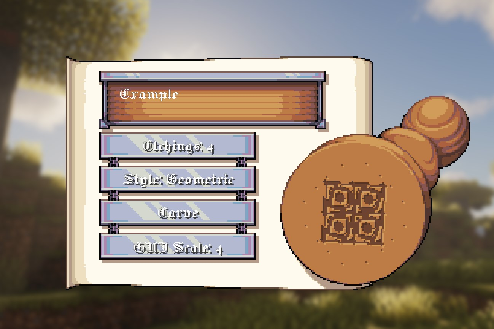
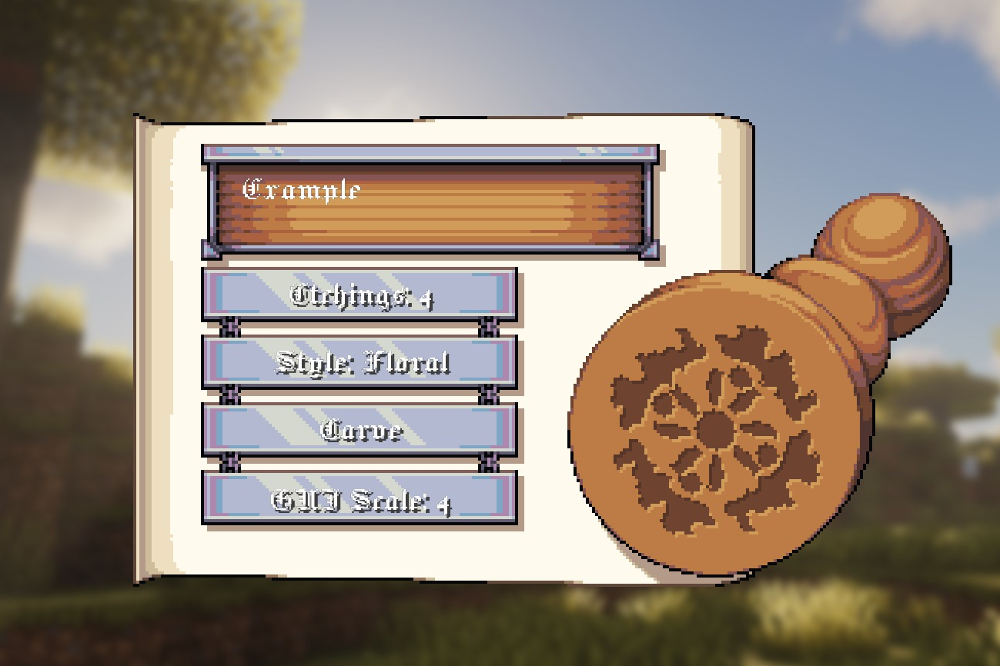
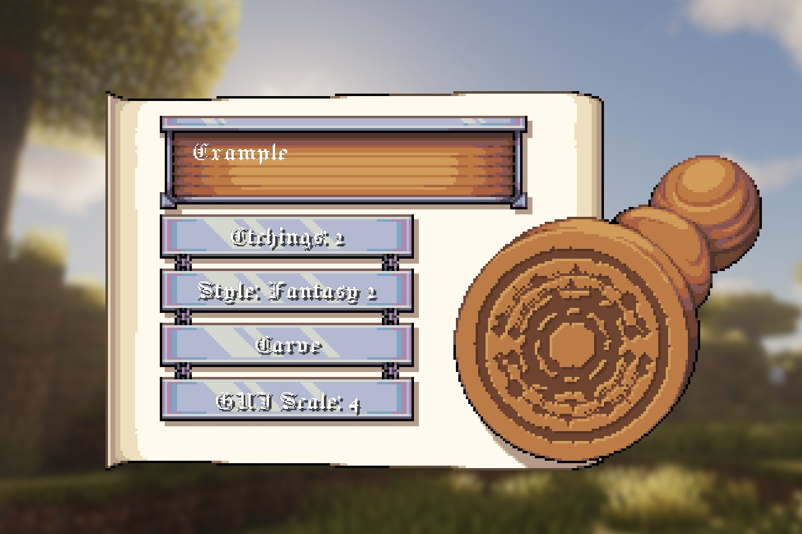
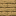

# Sigils (Seal Stamp)

Sigils are the *wax-seal designs* you stamp onto scrolls. They're cosmetic, but they do two important jobs:

- they make your scroll look like it actually came from someone (not a printer)
- they also lock in the "Sender" name the scroll shows later (your Seal Stamp's owner name)

TLDR: **carving a Seal Stamp is permanent**. Want a different sigil later? Make a new stamp.

---

## Examples

=== "Example 1"
    

=== "Example 2"
    

=== "Example 3"
    

=== "Example 4"
    

---

## Crafting the Seal Stamp

Any planks work (oak/spruce/birch/etc). The recipe is a 1-wide shape, so you can craft it in any column.

  

    

    

    

  

  
→

  

    

  

---

## Carving your sigil (etching the stamp)

1. Put the **Seal Stamp** in your hand.
2. **Right-click** to open the carving screen.
3. Type a **Secret** (up to 2 lines / 52 characters total).
4. Pick:
   - **Etchings** (2–8): basically "how many symmetry slices" your sigil uses.
   - **Style**: Medieval / Fantasy / Floral / Geometric (and their variants).
5. Hit **Carve**.

Carving takes about **1 second** and plays the little woodchip / etching particle bursts. When it's done, the screen closes and your stamp becomes **Etched**.

??? warning "You can't re-carve the same stamp"
    Once a stamp has Seal data saved on it, right-clicking it no longer opens the carving screen.
    If you want a new sigil, craft a new Seal Stamp.

---

## Stamping a scroll (where the sigil actually matters)

Your sigil gets used when you **seal a scroll**.

1. Open an **Unsealed Scroll** and write your message like normal.
2. Let the scroll do its sealing animation until it reaches the **SEALED** phase (the scroll is visually closed).
3. The game pops up a **Seal Stamp selector** (up to 9 stamps shown).
4. **Left-click** a stamp to select it.
5. Click inside the **wax area** to stamp the scroll.

### Favorite stamps (so you don’t keep re-picking it)

In the Seal Stamp selector:

- **Left-click** a stamp to select it.
- **Right-click** a stamp to set it as your **favorite** (right-click it again to clear the favorite).

Next time you seal a scroll, the selector tries to **auto-select your favorite** immediately.

Two gotchas:

- The selector only shows **up to 9** stamps. If you’re carrying a whole stamp collection, your favorite might not be in the shown list.
- Favorites are **client-side** and saved to your client config (so it sticks after restart), not to the server.

Rules that matter:

- The stamp must be **Etched**, otherwise sealing refuses to go through.
- The scroll stores your sigil as numbers (seed/slices/style) — **your Secret text is not stored** on the scroll.
- The scroll's **SenderName** is taken from the stamp's saved **Owner** name.

??? info "Curios support (optional)"
    If you're using Curios, the stamp selector can also pick up Seal Stamps equipped in Curios slots (it uses a dedicated Seal Stamp Curios slot).

---

## What changes the sigil (exactly)

Your carved design is generated from:

- **Secret** → turned into a 64-bit seed using SHA-256 (one-way hash)
- **Etchings** → slice count (2–8)
- **Style** → which shape set the generator uses

Same Secret + same Etchings + same Style = same sigil, every time.

??? info "What gets saved where (NBT / components)"
    The mod stores sigil data using `CustomData` (the 1.21+ item component).

    **On the Seal Stamp item**
    - `CustomData.SealStamp.Owner` (player name at carve time)
    - `CustomData.SealStamp.Seed` (long)
    - `CustomData.SealStamp.Slices` (int)
    - `CustomData.SealStamp.ShapeSet` (int)

    **On a Sealed Scroll item**
    - `CustomData.SealedScroll.Seed` (long)
    - `CustomData.SealedScroll.Slices` (int)
    - `CustomData.SealedScroll.Style` (int)
