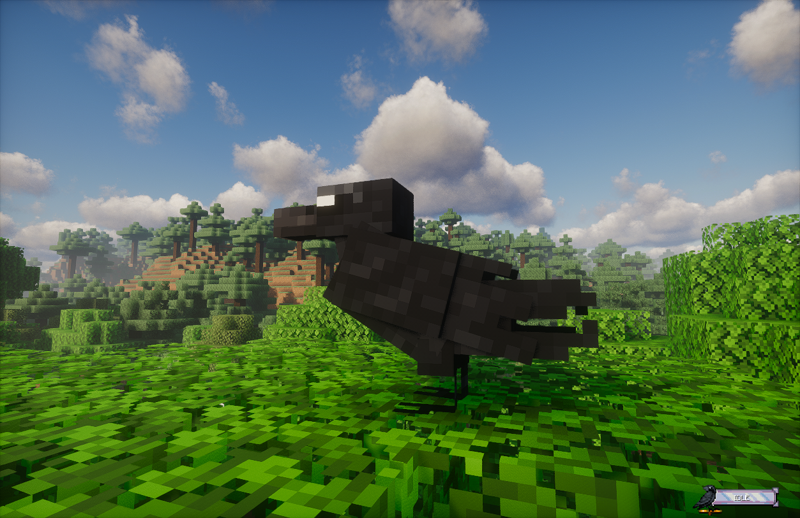

# Wild Ravens

Wild Ravens are the ones you spot **chilling on treetops** like they own the server. They're not pets yet. They're... vibes.

<figure markdown>

<figcaption>TONIGHT WILL BE THE NIGHT WHERE I WILL FIGHT FOR YOU</figcaption>
</figure>

---

## Finding them (where they show up)

Most of the time they'll spawn **above leaves**, so look up:

- forest canopies
- big oak roofs
- anywhere with a lot of leaf blocks and open air above them

If you're expecting them to spawn on the ground like chickens... yeah, no. Scan the treeline.

??? info "Spawn nerd notes"
    - FeatheredFriend's natural spawner tries periodically (not every tick).
    - It picks random columns around players, scans down until it finds leaves, then spawns a Raven **one block above**.
    - It also enforces a per-player wild Raven cap (server owners can tweak it in server settings).

---

## How they behave (a.k.a. why they keep leaving)

Wild Ravens don't like being rushed.

- Get too close (around "personal space" range) and they'll **fly off**.
- Get *way* too close (face-first sprinting) and they can **blink away** instead.

But if you're holding the right snack, they suddenly become your best friend.

---

## Luring a Wild Raven

You can lure a Wild Raven by holding either:

- **Iron Nugget**
- **Gold Nugget**

Keep the nugget in **either hand**. If you put it away, the Raven loses interest fast.

Also: if you're on a server with multiple players, the Raven won't "yoink-target-swap" every second. Once it's focused on you, it's basically locked in unless you drop the lure.

---

## Taming (the nugget "song")

Every Wild Raven has its own little taming combo: a **sequence of Iron + Gold nuggets**, length **3-6**.

You don't get a UI telling you the combo. You get *bird audio*.

- **Low pitch caw** = Iron
- **High pitch caw** = Gold

Example sequence you might hear: **Iron -> Iron -> Gold -> Iron -> Gold**

### Step-by-step tame

1. **Hold** an Iron or Gold Nugget and let the Raven come to you.
2. Listen to the caws and figure out the order.
3. **Right-click** the Raven with the correct nugget for the next step.
4. Repeat until the sequence is done.

??? warning "Don't mess up the order of nuggets"
    If you feed the wrong nugget, the Raven will still take it (yes, the nugget gets consumed - unless you're in Creative),
    and then it immediately decides your IQ is too subpar to be trusted with bird ownership and **despawns with FX**.

    Translation: you don't get to "continue the combo". You go find another Wild Raven and try again. Bring extras and don't spam-click.

---

## "Okay, it's tamed... now what?"

Once you finish the full nugget sequence, you'll get a **naming prompt**. After that, the Wild Raven despawns (on purpose) because it's now stored as *your* Raven companion.

One important rule: **you can only have one Raven companion per player**. If you already have a Raven, Wild Ravens won't let you start the taming process again.

*(We'll link the full "Your Raven" / summoning / Raven Link stuff here once that chapter exists.)*
